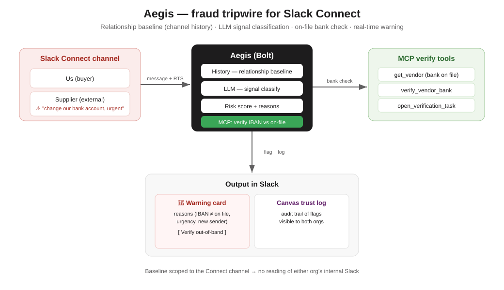

# Aegis

**A social-engineering and vendor-fraud tripwire for Slack Connect channels.**

[](https://github.com/samarthputhraya/aegis/actions/workflows/ci.yml)
[](LICENSE)
[](https://www.python.org/downloads/)

Aegis sits in the Slack Connect channel between your org and an external party and
watches for the highest-stakes attack on that surface: **business email compromise**
— *"our bank account changed, please remit to this IBAN, urgent, keep it confidential."*

It builds a relationship baseline from the channel, reads each external message for
social-engineering signals, checks any requested bank details against what's on file
via the verification tools in `mcp_server/` (also exposed as an MCP server, though the
agent calls them in-process), and flags the message **with its reasons** before finance can act.

Measured on the labeled set in `tests/fixtures/messages.jsonl`: **0 false positives
across 35 benign messages and 0 misses across 14 attacks**, both on an established
channel and on a brand-new one where every sender is unknown. That corpus is small and
written by the same person who wrote the detectors — see
[Known limitations](#known-limitations) before reading too much into it.

---

## Quickstart

No credentials needed — the demo and the whole test suite run offline.

```bash
git clone https://github.com/samarthputhraya/aegis.git
cd aegis

python -m venv .venv
source .venv/bin/activate          # Windows (Git Bash): source .venv/Scripts/activate
pip install -r requirements.txt

python scripts/simulate_attack.py  # replay a BEC attempt and show the flag
python tests/run_all.py            # 58 tests
```

Expected output from `simulate_attack.py`:

```
=== Aegis scan · Acme Supplies (bank on file DE89370400440532013000) ===

[CRITICAL  score=13]  Ravi K. (Acme Supplies)  2026-06-08
  msg: Hi, please note our bank account has changed. Kindly remit this month's
       invoice to IBAN GB29 NWBK 60161331926819. It's urgent - send today before
       5pm. Keep this confidential between us.
   - Payment/bank-detail change requested
   - Requested IBAN GB29…6819 ≠ IBAN on file DE89…3000
   - Urgency pressure ('urgent')
   - Secrecy cue ('confidential')
   - Sender 'Ravi K. (Acme Supplies)' not seen before in this channel
   MCP verify_vendor_bank -> match=False (on file DE89370400440532013000)
```

Run the MCP verification server on its own:

```bash
python -m mcp_server.server               # stdio transport
MCP_HTTP=1 python -m mcp_server.server    # streamable-http transport
```

## Running it against real Slack

Aegis is cross-org, so a real test needs two workspaces and a Slack Connect channel
between them. **[docs/E2E.md](docs/E2E.md)** walks through it — app creation, scopes,
the Connect channel, and the live demo.

```bash
cp .env.example .env               # fill in the tokens
bash scripts/start_socket_mode.sh  # Socket Mode: no public URL, no tunnel
```

---

## How it works

```
external message in a Connect channel
      │
      ▼
 reasoner.classify()  ───────────►  payment_change · credential_request · urgency
 (LLM; falls back to               secrecy · out_of_band_redirect · iban_present
  signals.detect offline)          IBAN always extracted by regex, never by model
      │
      ▼
 slack_io.fetch_history()  ──────►  conversations.history, or Real-Time Search
      │                             (assistant.search.context)
      ▼
 baseline.build()  ──────────────►  who normally talks here? what IBAN is on file?
      │
      ▼
 risk.assess()     ──────────────►  verify_vendor_bank(requested_iban)  (mcp_server.tools)
      │                              score → low / medium / high / critical
      ▼
 surfaces.post_warning()    ─────►  Block Kit card in thread, with reasons + buttons
 surfaces.upsert_trust_log() ────►  Canvas trust log on the channel (audit trail)
```



### Scoring

| Signal | Points |
|---|---|
| Payment / bank-detail change requested | +3 |
| Requested IBAN ≠ IBAN on file (MCP check) | +4 |
| Credentials or secrets requested | +4 |
| Urgency pressure | +2 |
| Secrecy cue | +2 |
| Pushes the conversation off-channel | +2 |
| Sender not seen before in this channel | +2 |

Levels: `critical` ≥ 7 · `high` ≥ 5 · `medium` ≥ 3 · `low` otherwise. Aegis posts a
warning at `high` and above.

Model-produced signals are scaled by the classifier's confidence. The IBAN mismatch is
not — it's a comparison against a record, not a judgement. It also runs whenever an IBAN
appears, not only when a "change" word did, because *"our details are now IBAN …"* is the
same attack without the keyword. On its own a mismatch scores 4, which is `medium`: it
needs corroboration before Aegis raises an alert.

---

## Layout

```
aegis/signals.py        Deterministic signal detector (stdlib only) — the floor
aegis/reasoner.py       LLM classification (Anthropic or generic), merged with the regex IBAN
aegis/slack_io.py       Channel history via conversations.history or RTS; name lookups
aegis/baseline.py       Relationship baseline (known senders, IBAN on file)
aegis/risk.py           Confidence-weighted scoring + on-file bank check via MCP
aegis/surfaces.py       Block Kit card + Canvas trust log builders and senders
aegis/orchestrator.py   evaluate() one message / scan() a whole thread
aegis/handlers.py       The live decision logic, free of Bolt so it can be tested
app.py                  Bolt wiring: Socket Mode and Flask/HTTP entrypoints
mcp_server/             FastMCP server: get_vendor, verify_vendor_bank, open_verification_task
scripts/                simulate_attack.py (offline demo), start_socket_mode.sh
tests/                  run_all.py + 5 modules: detection, reasoner, live paths,
                        regressions, and a labeled eval set
docs/E2E.md             Two-workspace live setup, end to end
docs/ROADMAP.md         What's left, in order
CLAUDE.md               Build context for Claude Code
```

---

## Implementation status

Being precise about this, because it's a security tool and overclaiming would be worse
than useless.

### Implemented and tested

- **Signal detection** (`aegis/signals.py`) — payment changes, credential requests,
  urgency, secrecy, off-channel redirects, and exact IBAN extraction. Stdlib only.
- **LLM classification** (`aegis/reasoner.py`) — the Anthropic Messages API by default,
  or any generic completion endpoint. Untrusted model output is validated: unknown signal
  types dropped, confidence clamped, fenced JSON unwrapped. **Any provider failure falls
  back to the offline detector** rather than going blind.
- **Channel history** (`aegis/slack_io.py`) — `conversations.history` by default, or
  Slack's Real-Time Search (`assistant.search.context`) with `HISTORY_SOURCE=rts`.
- **Risk scoring** (`aegis/risk.py`) — confidence-weighted, with human-readable reasons.
- **MCP server** (`mcp_server/`) — FastMCP exposing `get_vendor`, `verify_vendor_bank`,
  and `open_verification_task`. The last opens a real GitHub issue when `GITHUB_TOKEN`
  and `GITHUB_REPO` are set.
- **Live message handling** (`aegis/handlers.py`, `app.py`) — external messages are
  scanned, the message under evaluation is excluded from its own baseline, and warnings
  post in thread at `high`/`critical`. Socket Mode is the entrypoint that has been run;
  the HTTP one is implemented but has never been exercised, live or in tests.
- **Buttons** — *Verify out-of-band* re-runs the bank check, replies in thread with both
  account numbers masked (the thread is visible to the counterparty), and opens a verification task. *Mark safe* records the sender as
  trusted in that channel, without clearing IBAN-mismatch checks.
- **Canvas trust log** — created via `conversations.canvases.create`, updated via
  `canvases.edit`. Failures are logged and never suppress the warning.
- **Verified in a live Slack Connect channel** (August 2026). Between two workspaces
  sharing a Connect channel, running in Socket Mode: the planted bank-change message
  produced the CRITICAL card in-channel, *Verify out-of-band* ran the MCP bank check and
  replied in thread with the comparison, the *Aegis trust log* canvas was created on the
  channel, and ordinary vendor chatter produced nothing. See
  [Known limitations](#known-limitations) for what that run did **not** cover.
- **Tests** — 51, all offline. A fake Slack client (`tests/fake_slack.py`) drives the live
  paths, deliberately mimicking `SlackResponse` rather than returning plain dicts.
  `tests/test_eval.py` measures false-positive and false-negative rates against the
  labeled corpus and fails CI if they regress. `tests/test_regressions.py` pins the
  fail-open bugs listed below so they cannot come back (one of the eight, the empty-model
  response, is pinned in `tests/test_reasoner.py`).

### Fail-open bugs found and fixed

Worth stating plainly, since they're the reason to trust the current version more than
the previous one. Each has a named regression test:

- **Only the first IBAN was checked.** "Do not use DE89…, remit to GB29…" names the
  legitimate account first, so the bank check compared against the account the attacker
  was replacing — and passed. All IBANs in a message are now checked.
- **The IBAN regex was uppercase-only and greedy.** A lowercased account number produced
  no signal at all; an uppercase word after a valid IBAN got absorbed into it, corrupting
  the number. Extraction is now case-insensitive, scans at group boundaries, and
  validates with the ISO 7064 mod-97 checksum.
- **The model could disarm the detector.** With a provider configured, `signals.detect`
  was skipped entirely, so a model returning `[]` — truncated, refused, or steered by a
  prompt injection in the vendor's own message — silently scored a live attack as
  `medium`. The offline detector is now a floor the model can add to but never subtract
  from.
- **Edited messages were never scanned.** Post something bland, edit it into the payment
  request: `message_changed` was skipped wholesale.
- **Keyword matching was substring-based.** "wire" fired on *wireless*, "ach" on
  *attached* and *approach* — a red fraud card at your vendor over a shipping note.
- **`dict()` on a `SlackResponse` raises**, so every Real-Time Search fetch would have
  failed and fallen back to an empty baseline — the exact fail-open `slack_io` claims to
  refuse. The tests missed it because the fake client returned plain dicts.
- **"No bank record on file" was reported as a confirmed mismatch**, so a typo in
  `VENDOR_KEY` made every IBAN look like fraud and filed a verification task asserting it.
- **A history outage tagged everyone as a new sender**, adding a spurious reason to every
  card at exactly the moment the tool was least able to judge.

### Known limitations

Read these before trusting it with anything.

- **One live run is not a soak test, and CI still can't reach Slack.** The August 2026
  run above covered the demo path on a small channel. Specifically **not** exercised:
  the Real-Time Search history source (`HISTORY_SOURCE=rts` — the default is
  `conversations.history`, so the RTS response envelope remains the one genuinely
  unverified shape in the repo), HTTP mode, the *Mark safe* button, more than one vendor,
  sustained operation, and any channel busy enough to hit Slack's rate limits — which
  `slack_io.fetch_history` does not yet back off from. Every automated test runs against
  a fake client, so the suite passing is evidence about the logic, not about Slack.
- **The RTS response envelope is unverified.** `assistant.search.context`'s request
  arguments are documented; its response shape is not published. `slack_io` accepts the
  plausible shapes and **raises** on anything else rather than returning an empty baseline,
  because failing open is the worst outcome for a tripwire. The default source is
  `conversations.history`, which is fully specified.
- **Vendor data is mock.** `mcp_server/data/vendors.json` holds one fictional vendor.
  There's no finance or CRM integration; a real deployment needs `verify_vendor_bank`
  pointed at a system of record.
- **State is in-memory.** The trust log and "mark safe" decisions live in a dict and reset
  when the process restarts.
- **The eval corpus is small and self-authored.** 35 benign and 14 malicious messages,
  written by the same person as the detectors. 0% / 0% on it means the obvious cases work;
  it does not mean the false-positive rate on your real vendor channel is zero. Growing
  this corpus with real (redacted) traffic is roadmap item 1.
- **English-only, and single-message.** No cross-message reasoning: a slow-burn attack
  spread over several innocuous-looking messages won't be caught.
- **Detection is still keyword-shaped without an API key.** The model path catches
  paraphrases the keyword list misses; the offline path, by construction, does not.

---

## Configuration

Copy `.env.example` to `.env`. Everything in the Quickstart runs with no configuration.

| Variable | Required for | Notes |
|---|---|---|
| `SLACK_BOT_TOKEN` | Live Slack | Bot token, `xoxb-…` |
| `SLACK_APP_TOKEN` | Socket Mode | App-level token, `xapp-…`, `connections:write` |
| `SLACK_SIGNING_SECRET` | HTTP mode | From Basic Information |
| `SLACK_MODE` | — | `socket` for Socket Mode, anything else for HTTP |
| `OUR_TEAM_ID` | Live Slack | Your workspace's team ID; its messages are never scanned |
| `VENDOR_KEY` | Live Slack | Key into `mcp_server/data/vendors.json` |
| `HISTORY_SOURCE` | — | `conversations` (default) or `rts` |
| `HISTORY_LIMIT` | — | Messages to pull for the baseline, default 200 |
| `ANTHROPIC_API_KEY` | LLM path | Unset ⇒ offline detector |
| `LLM_API_KEY`, `LLM_URL`, `LLM_MODEL` | Non-Anthropic provider | See `.env.example` |
| `GITHUB_TOKEN`, `GITHUB_REPO` | Real verification tasks | Unset ⇒ mock task |
| `PORT`, `LOG_LEVEL` | — | Default 3000 / INFO |

`.env` is gitignored, and CI fails the build if a credential-shaped string appears in the
tree. Never commit real tokens.

---

## Background

Aegis was built for the Slack Agent Builder Challenge (New Slack Agent track). The
premise: every other Slack-agent idea competes in the crowded productivity lane, while
trust and safety is largely uncontested — and BEC is a board-level problem, averaging
around $4.67M per incident by IBM's 2025 figures.

**Prior art, honestly:** the category is not empty. Abnormal AI and DoControl do
platform-level Slack threat detection. Aegis's distinction is the focused, in-channel,
baseline-driven agent framing rather than a broad security platform.

## Contributing

See [CONTRIBUTING.md](CONTRIBUTING.md). The most useful contribution right now is
adversarial eval cases — benign messages that trip it, or attacks that slip past.

## License

[MIT](LICENSE)
